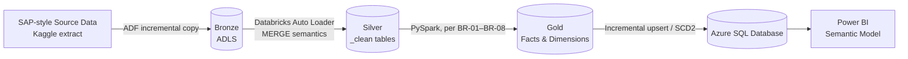
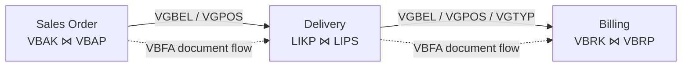

# SAP OTC / Order-to-Cash Reporting Platform

> **Data Engineering Training Project — Batch 1**
> An end-to-end Order-to-Cash (OTC) analytics platform for SAP Sales & Distribution (SD) data — from a Business Requirement Document to a Power BI-ready Gold layer on Azure.


---

## 📋 Overview

This project simulates a real-world Data Engineering engagement for the **Sales & Distribution (SD)** module of a manufacturing/distribution company running SAP ECC. Acting as Data Engineers, we took a Business Requirement Document (BRD) from a Business Analyst and an architecture blueprint from a Data Architect, and built the ingestion, transformation, and data modelling pipeline end to end.

Since live SAP ECC access isn't available for this training project, source data is a publicly available extract of standard SAP tables — the [`mustafakeser4/sap-dataset-bigquery-dataset`](https://www.kaggle.com/datasets/mustafakeser4/sap-dataset-bigquery-dataset) Kaggle dataset — replicated exactly as a real SAP landscape would expose them (header/item pairs, document flow tables, master data).

**Business objective:** reconstruct the SAP Order-to-Cash process (Sales Order → Delivery → Billing), convert all monetary values into a single Group Reporting Currency, and expose the result as a governed Power BI semantic model for self-service sales performance reporting.

---

## 🧱 Architecture

The platform follows a **medallion architecture** (Bronze → Silver → Gold), orchestrated through Azure Data Factory and Databricks, with Azure SQL Database as the serving layer and Power BI on top.



| Layer | Description |
|---|---|
| **Bronze** | Raw source data landed via ADF incremental copy, partitioned by load date. Minimal transformation. |
| **Silver** | Cleaned, deduplicated staging tables (suffixed `_clean`, e.g. `vbak_clean`, `likp_clean`). Loaded via Databricks Auto Loader with MERGE semantics. |
| **Gold** | Conformed dimensional model — fact tables (`Fact_SalesOrder`, `Fact_Delivery`, `Fact_Billing`) and dimension tables (`Dim_Customer`, `Dim_Material`, `Dim_Date`, `Dim_SalesOrganization`, `Dim_CurrencyRate`), built per BR-01 to BR-08. |
| **Azure SQL DB** | Gold tables published to the serving layer via incremental upsert/SCD2 logic for Power BI consumption. |

**Storage:** `dbw_sdotc_dev` catalog, split into `bronze` / `silver` / `gold` schemas. The Silver schema has grown to **37 tables**, including cleaned staging tables for all 12 available source tables plus supporting objects (`dq_exceptions`, `dq_reconciliation_summary`, `open_order_value`, and others).

---

## 🔗 Order-to-Cash Document Chain

SAP SD represents a sale as a chain of three linked documents, connected through the document flow table `VBFA`:



`VBFA` stores each link as preceding document → subsequent document with a document category (`VBTYP_N`). One order line can fan out into **zero, one, or many** deliveries and invoices — this 1-to-many relationship is preserved throughout, never assumed 1:1.

---

## 🗂 Data Sources

The BRD called for **14 source tables**; the replicated Kaggle dataset only contained **12**. Missing tables (`KNVV`, `MVKE`) were resolved by profiling the available tables rather than escalating immediately:

| Missing Field | Substitute Found | Match Quality |
|---|---|---|
| `MVKE.MVGR1` (Material Group 1) | `VBAP.mvgr1` | ✅ Exact |
| `KNVV.VWERK` (Delivering Plant) | `KNA1.werks` | ✅ Exact |
| `KNVV.KDGRP` (Customer Group) | `VBAK` / `LIPS` `KVGR1-5` | ⚠️ Approximate — flagged to BA |

Full write-up: `US-1.3_Source_Data_Gap_Report.docx`

<details>
<summary><b>Source tables used</b> (click to expand)</summary>

| Table | Description | Grain / Key |
|---|---|---|
| `VBAK` | Sales Document – Header | 1 row per Sales Order (VBELN) |
| `VBAP` | Sales Document – Item | 1 row per Order line (VBELN + POSNR) |
| `LIKP` | Delivery – Header | 1 row per Delivery (VBELN) |
| `LIPS` | Delivery – Item | 1 row per Delivery line (VBELN + POSNR) |
| `VBRK` | Billing Document – Header | 1 row per Billing doc (VBELN) |
| `VBRP` | Billing Document – Item | 1 row per Billing line (VBELN + POSNR) |
| `VBFA` | Sales Document Flow | 1 row per document-to-document link |
| `KNA1` | Customer Master – General Data | 1 row per Customer (KUNNR) |
| `MARA` | Material Master – General Data | 1 row per Material (MATNR) |
| `MAKT` | Material Descriptions | 1 row per Material + Language |
| `TCURR` | Exchange Rates | 1 row per Rate type + currency pair + date |
| `TCURF` | Exchange Rate Ratios | 1 row per Rate type + currency pair + date |

</details>

---

## 🥇 Gold Layer Fact Tables

Built in BRD epic order — Fact_SalesOrder (Epic 6) → Fact_Delivery (Epic 7) → Fact_Billing (Epic 8):

| Fact Table | Built From | Key Notes |
|---|---|---|
| **`Fact_SalesOrder`** | `VBAK` ⋈ `VBAP` | USD conversion built inline against `tcurr`/`tcurf` per BR-07; `group_currency` column added |
| **`Fact_Delivery`** | `LIKP` ⋈ `LIPS` | Linked to `Fact_SalesOrder` via `VGBEL`/`VGPOS`; calculates order-to-delivery lead time |
| **`Fact_Billing`** | `VBRK` ⋈ `VBRP` | Linked via `VGBEL`/`VGPOS`/`VGTYP`; full currency-audit column set applied |

---

## 💱 Currency Standardization (BR-07)

Monetary fields land in whatever local/document currency the transaction was recorded in (CAD appears frequently in this dataset) — so revenue can't simply be summed across records.

**Standard applied:** convert every monetary value to **USD** (Group Reporting Currency) using exchange rate type **`'M'`**, sourced from the `TCURR` / `TCURF` silver tables — applied as a standing rule across the whole Gold layer.

> **Why not the existing `vbap_currency_converted` table?**
> It looked pre-solved — until we inspected it. Its `netwr` column was still in the original document currency, with no exchange-rate or rate-date column to audit it against. The conversion was rebuilt inline, straight against `tcurr` and `tcurf`.

Every monetary fact now carries a consistent audit-column set:

```
source_currency · group_currency · exchange_rate · rate_date · item_net_value · converted_value_usd
```

---

## 🛠 Data Quality Issues & Resolutions

| # | Problem | Resolution | Status |
|---|---|---|---|
| 1 | **Source data gap** — 2 of 14 BRD tables (`KNVV`, `MVKE`) missing from the replicated dataset | Profiled available tables first; found exact substitutes for 2 of 3 missing fields, flagged the one approximate proxy to the BA | ✅ Resolved |
| 2 | **Currency inconsistency** — monetary fields sat in local currency; the table that looked pre-converted wasn't | Built USD conversion inline against `tcurr`/`tcurf` per BR-07, with a full audit-column set on every fact | ✅ Resolved |
| 3 | **Surrogate key grain mismatch** — `Dim_SalesOrganization` keys on 3 columns (`vkorg`+`vtweg`+`spart`); facts only carried 1, breaking SK lookups | Adding `vtweg` + `spart` to `Fact_Billing`; same fix tracked separately for remaining facts | 🟡 In Progress |

---

## ✅ Reconciliation & Auditability

Row counts and `sum(NETWR)` are compared between **Bronze** and **Gold** for each table after every load, so a silent drop or duplication surfaces as a variance instead of going unnoticed.

- `dq_exceptions` — logged data-quality exceptions (e.g. currency lookups with no matching rate)
- `dq_reconciliation_summary` — Bronze vs. Gold row count / value reconciliation

Rolling out in two passes: an initial pass now, and the remaining checks alongside final documentation and handover.

---

## 📊 Current Status

- [x] `Fact_SalesOrder`, `Fact_Delivery`, `Fact_Billing` built and checked against BR-01, BR-02, BR-03, BR-07
- [x] Gold → Azure SQL Database publishing live (facts, SCD2 dimensions, static dimensions)
- [x] Source data gap profiled and documented
- [x] Currency conversion standardized to USD with full audit trail
- [ ] `Fact_Billing` surrogate key fix (in progress) — extend to `Fact_SalesOrder` and remaining facts
- [ ] Second pass of Bronze → Gold reconciliation checks

---

## 📁 Repository Structure

> Suggested layout — adjust to match your actual repo.

```
sap-otc-reporting-platform/
├── adf/                        # Azure Data Factory pipeline definitions
├── notebooks/
│   ├── bronze/                 # Raw ingestion notebooks
│   ├── silver/                 # Cleansing & deduplication (_clean tables)
│   └── gold/                   # Fact & dimension build notebooks
├── sql/                        # Azure SQL DB publish / SCD2 scripts
├── powerbi/                    # Power BI semantic model (.pbix)
├── docs/
│   ├── Business_Requirement_Document_SD.docx
│   ├── US-1.3_Source_Data_Gap_Report.docx
│   └── SAP_OTC_Platform_Documentation.pdf
└── README.md
```

---

## 👥 Team

**Data Engineer — Batch 1**

| Name |
|---|
| Reshmi Rakesh P |
| Thajunnisa N |
| Athira NK |
| Sruthy TS |

**Project:** SD Analytics Project (Order-to-Cash Reporting Platform)
**Source data:** [Kaggle — SAP Dataset \| BigQuery Dataset](https://www.kaggle.com/datasets/mustafakeser4/sap-dataset-bigquery-dataset)

---

